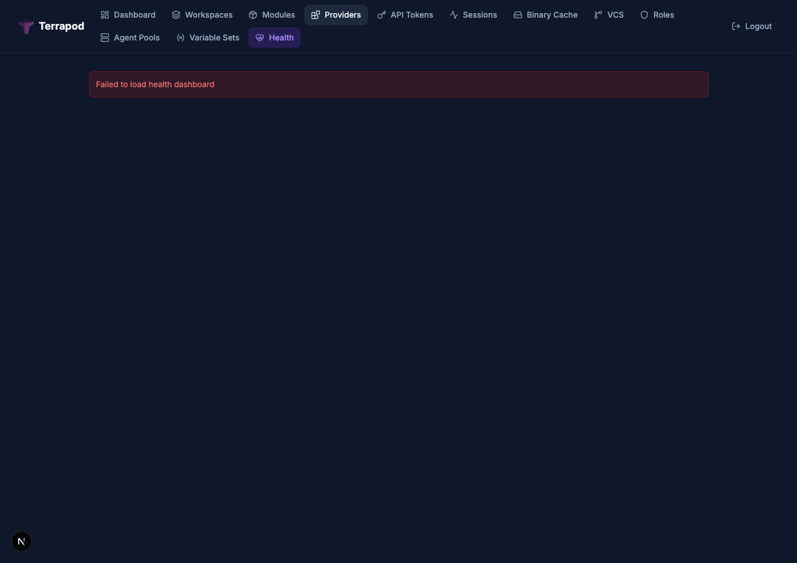

# Health Dashboard

The health dashboard provides an operational overview of workspace health, drift status, run metrics, and runner listener availability. It is available to users with the `admin` or `audit` role.



---

## API

```
GET /api/v2/admin/health-dashboard
```

Requires `admin` or `audit` role.

### Response

```json
{
  "data": {
    "type": "health-dashboards",
    "attributes": {
      "workspaces": {
        "total": 50,
        "locked": 2,
        "drift-enabled": 15,
        "by-drift-status": {
          "unchecked": 5,
          "no-drift": 7,
          "drifted": 2,
          "errored": 1
        },
        "stale": [
          {
            "id": "ws-uuid",
            "name": "prod-infrastructure",
            "last-applied-at": "2025-02-15T10:30:00Z",
            "days-since-apply": 18,
            "drift-status": "drifted"
          }
        ]
      }
    }
  }
}
```

### Data Points

| Metric | Description |
|---|---|
| `total` | Total number of workspaces |
| `locked` | Workspaces currently locked |
| `drift-enabled` | Workspaces with drift detection enabled |
| `by-drift-status` | Breakdown of workspaces by drift status |
| `stale` | Top 20 workspaces sorted by days since last apply (workspaces that have never been applied appear first) |

---

## Drift Status Aggregation

The dashboard groups all workspaces by their `drift_status` value:

| Status | Meaning |
|---|---|
| `unchecked` | Drift detection enabled but no check has run |
| `no-drift` | Latest drift check found no changes |
| `drifted` | Latest drift check detected infrastructure changes |
| `errored` | Latest drift check failed |

See [Drift Detection](drift-detection.md) for details on how drift status is determined.

---

## Staleness

A workspace is considered stale based on how long ago its last successful apply was. The dashboard returns the top 20 stalest workspaces, sorted by `days-since-apply` descending. Workspaces that have never been applied (null `last-applied-at`) appear first.

---

## See Also

- [Drift Detection](drift-detection.md) — how drift status is tracked
- [RBAC](rbac.md) — `admin` and `audit` role requirements
- [API Reference](api-reference.md) — full endpoint documentation
