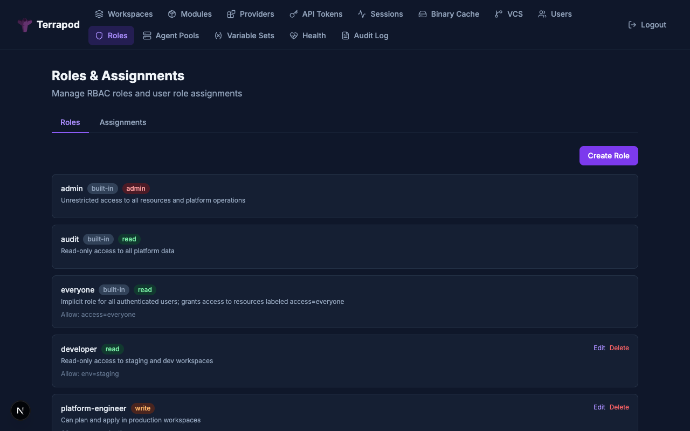
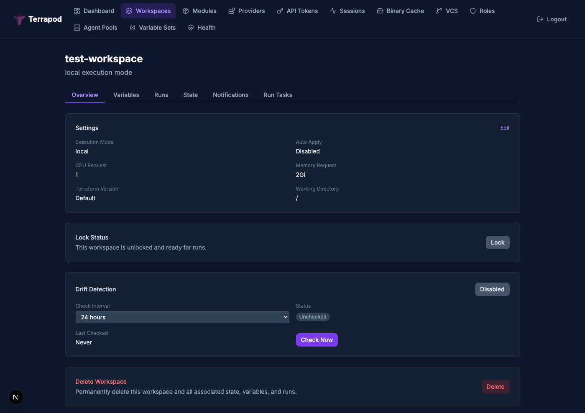

# Role-Based Access Control (RBAC)

Terrapod uses a label-based RBAC system instead of Terraform Enterprise's team model. Labels replace teams entirely -- a "team" is just a label. This document covers the permission model, role configuration, and common patterns.

---

## Permission Model

### Workspace Permission Levels

Workspace permissions are strictly hierarchical -- each level includes all permissions from the levels below it:

| Level | Grants |
|---|---|
| **read** | View workspace, view runs and plan output, view state metadata, view non-sensitive variables |
| **plan** | read + queue plan-only runs, lock/unlock (own locks), download raw state |
| **write** | plan + confirm/discard applies, create apply runs, CRUD variables, upload state/config, rollback state versions |
| **admin** | write + update/delete workspace, change VCS/execution settings, change labels, delete state versions. Cannot change owner (platform admin only) |

### Registry Permission Levels

Modules and providers use a similar three-level hierarchy (no "plan" concept):

| Level | Grants |
|---|---|
| **read** | View module/provider, download artifacts |
| **write** | read + create versions, upload artifacts |
| **admin** | write + update/delete module/provider, change labels |

A role's `workspace_permission` maps to registry permissions: `plan` maps to `read`.

**Runner tokens** receive implicit `read` access to all registry modules and providers. This allows runner Jobs to download modules and providers during `terraform init` without requiring explicit label-based permissions on each registry resource.

### Pool Permission Levels

Agent pools use a three-level hierarchy (separate from workspace permissions):

| Level | Grants |
|---|---|
| **read** | View pool, list listeners |
| **write** | read + assign pool to workspaces |
| **admin** | write + manage tokens, update/delete pool |

Each custom role has a `pool_permission` field (default: `read`) that is independent of `workspace_permission`. Assigning a pool to a workspace requires **both** `write` on the pool **and** `admin` on the workspace.

Pool permission resolution follows the same order as workspace permissions:

1. **Platform admin** → `admin` on all pools
2. **Platform audit** → `read` on all pools
3. **Pool owner** (`pool.owner_email == user.email`) → `admin`
4. **Label-based RBAC** — custom roles matched against pool labels using `pool_permission`
5. **`everyone` role** — pools with label `access: everyone` → `read`
6. **Default** → no access (pool is invisible)

### Platform Permissions

| Operation | Required Role |
|---|---|
| Manage roles and assignments | `admin` |
| Manage VCS connections | `admin` |
| Create agent pools | `admin` |
| Manage agent pool tokens, update/delete pool | Pool `admin` (owner, platform admin, or role-based) |
| Binary/module/provider cache admin | `admin` |
| View roles, VCS connections | `admin` or `audit` |
| View agent pools | Any authenticated user (filtered by pool RBAC) |
| Create workspaces | Any authenticated user (creator becomes owner) |
| Create registry modules/providers | Any authenticated user (creator becomes owner) |
| Variable sets (create/update/delete) | `admin` |

---



## Built-in Roles

Terrapod has three built-in roles that cannot be modified or deleted:

| Role | Behavior |
|---|---|
| **admin** | Bypasses all RBAC checks. Full access to every workspace, registry item, and platform operation. |
| **audit** | Read-only access to all workspaces and registry items. Can view (but not modify) roles, VCS connections, and agent pools. |
| **everyone** | Implicit role assigned to all authenticated users. Grants `read` access to workspaces that have the label `access: everyone`. |

---

## Permission Resolution Order

When a user accesses a workspace, permissions are resolved in this order. The first match wins (highest to lowest priority):

```
1. Platform admin?
   YES --> admin permission on ALL workspaces
   NO  --> continue

2. Platform audit?
   YES --> read permission on ALL workspaces
   NO  --> continue

3. Workspace owner? (ws.owner_email == user.email)
   YES --> admin permission on this workspace
   NO  --> continue

4. Label-based RBAC (custom roles):
   For each custom role the user holds:
     a. Check allow rules (labels + names)
     b. Check deny rules (labels + names)
     c. If workspace matches allow AND does NOT match deny:
        collect that role's workspace_permission
   Take the HIGHEST collected permission
   |
   v (if any permission found, use it)

5. "everyone" role:
   If workspace has label "access: everyone" --> read permission
   |
   v (otherwise)

6. Default: no access (403)
```

---

## Custom Roles

Custom roles define access using allow/deny rules on labels and workspace names.

### Creating a Custom Role

```zsh
curl -X POST https://terrapod.example.com/api/v2/roles \
  -H "Authorization: Bearer $TERRAPOD_TOKEN" \
  -H "Content-Type: application/vnd.api+json" \
  -d '{
    "data": {
      "type": "roles",
      "attributes": {
        "name": "developer",
        "description": "Can plan and write to development workspaces",
        "workspace-permission": "write",
        "allow-labels": {"env": "dev"},
        "allow-names": [],
        "deny-labels": {},
        "deny-names": []
      }
    }
  }'
```

### Role Attributes

| Attribute | Type | Description |
|---|---|---|
| `name` | string | Unique role name (lowercase, alphanumeric + hyphens) |
| `description` | string | Human-readable description |
| `workspace-permission` | string | One of: `read`, `plan`, `write`, `admin` |
| `pool-permission` | string | One of: `read`, `write`, `admin` (default: `read`) |
| `allow-labels` | object | Label key-value pairs that grant access |
| `allow-names` | array | Explicit workspace names that grant access |
| `deny-labels` | object | Label key-value pairs that deny access (overrides allow) |
| `deny-names` | array | Explicit workspace names that deny access (overrides allow) |

### Label Matching Rules

- **Allow labels**: A workspace matches if ANY specified label key-value pair matches (OR across keys)
- **Allow names**: A workspace name must appear in the list to match
- **A workspace matches if it matches allow-labels OR allow-names**
- **Deny labels**: If a workspace has ANY specified deny label, access is denied regardless of allow rules
- **Deny names**: If a workspace name appears in the deny list, access is denied
- **Deny always wins over allow**

### Listing Roles

```zsh
curl https://terrapod.example.com/api/v2/roles \
  -H "Authorization: Bearer $TERRAPOD_TOKEN"
```

Returns both built-in and custom roles.

### Updating a Role

```zsh
curl -X PATCH https://terrapod.example.com/api/v2/roles/developer \
  -H "Authorization: Bearer $TERRAPOD_TOKEN" \
  -H "Content-Type: application/vnd.api+json" \
  -d '{
    "data": {
      "type": "roles",
      "attributes": {
        "workspace-permission": "plan",
        "allow-labels": {"env": "dev", "team": "platform"}
      }
    }
  }'
```

### Deleting a Role

```zsh
curl -X DELETE https://terrapod.example.com/api/v2/roles/developer \
  -H "Authorization: Bearer $TERRAPOD_TOKEN"
```

Built-in roles (`admin`, `audit`, `everyone`) cannot be deleted.

---

## Role Assignments

Role assignments bind a user (identified by provider + email) to a role.

### Setting Roles for a User

```zsh
curl -X PUT https://terrapod.example.com/api/v2/role-assignments \
  -H "Authorization: Bearer $TERRAPOD_TOKEN" \
  -H "Content-Type: application/vnd.api+json" \
  -d '{
    "data": {
      "type": "role-assignments",
      "attributes": {
        "provider-name": "local",
        "email": "alice@example.com",
        "roles": ["developer", "sre-reader"]
      }
    }
  }'
```

For platform roles (admin, audit):

```zsh
curl -X PUT https://terrapod.example.com/api/v2/role-assignments \
  -H "Authorization: Bearer $TERRAPOD_TOKEN" \
  -H "Content-Type: application/vnd.api+json" \
  -d '{
    "data": {
      "type": "role-assignments",
      "attributes": {
        "provider-name": "local",
        "email": "alice@example.com",
        "roles": ["admin"]
      }
    }
  }'
```

### Listing All Assignments

```zsh
curl https://terrapod.example.com/api/v2/role-assignments \
  -H "Authorization: Bearer $TERRAPOD_TOKEN"
```

### Removing a Single Assignment

```zsh
curl -X DELETE https://terrapod.example.com/api/v2/role-assignments/local/alice@example.com/developer \
  -H "Authorization: Bearer $TERRAPOD_TOKEN"
```

---

## Workspace Labels and Ownership

Labels are visible in the workspace overview and can be managed from the workspace settings.



### Setting Labels on a Workspace

Labels are key-value pairs set on workspace creation or update:

```zsh
curl -X PATCH https://terrapod.example.com/api/v2/workspaces/ws-{id} \
  -H "Authorization: Bearer $TERRAPOD_TOKEN" \
  -H "Content-Type: application/vnd.api+json" \
  -d '{
    "data": {
      "type": "workspaces",
      "attributes": {
        "labels": {
          "env": "production",
          "team": "platform",
          "region": "eu-west-1"
        }
      }
    }
  }'
```

### Workspace Ownership

- The user who creates a workspace automatically becomes its owner
- Owners have `admin` permission on their workspace
- Only a platform admin can change workspace ownership

### Label Limits

Labels are validated at the API on workspace, agent pool, and registry module/provider create or update. The API returns **422 Unprocessable Entity** if any of the following limits are violated:

| Limit | Value |
|---|---|
| Maximum labels per resource | 50 |
| Maximum label key length | 63 characters |
| Maximum label value length | 255 characters |

Keys and values must be strings.

### Reserved Label Keys

A small set of label keys are reserved as **virtual filter fields** in the workspace-list filter UI. A filter term like `status:errored` resolves against a workspace's derived status, not against a literal label called `status`. To keep that filter language unambiguous, these keys cannot be used as literal labels — the API rejects them on create and update with 422.

| Reserved key | Maps to | Filter status |
|---|---|---|
| `status` | derived run status (`errored`, `needs-confirm`, `drifted`, `applied`, …) | implemented |
| `pool` | `agent_pool_name` | reserved (future virtual) |
| `mode` | `execution_mode` (`local`/`agent`) | reserved (future virtual) |
| `backend` | `execution_backend` (`tofu`/`terraform`) | reserved (future virtual) |
| `owner` | `owner_email` | reserved (future virtual) |
| `drift` | `drift_status` (`drifted`/`in_sync`/`never_checked`) | reserved (future virtual) |
| `version` | `terraform_version` | reserved (future virtual) |
| `vcs` | true if the workspace has a VCS connection | reserved (future virtual) |
| `locked` | `locked` boolean | reserved (future virtual) |
| `branch` | `vcs_branch` | reserved (future virtual) |

If you have an existing label with one of these keys (from a deployment that pre-dates this restriction), reads and existing rows continue to work, but the next create or update of that resource that includes the reserved key in its `labels` field will be rejected. Migrate by renaming — for example, swap `pool: shared` for `team-pool: shared` (or simply drop it if the same data is already on `agent_pool_id`).

The list lives in `terrapod.services.label_validation.RESERVED_LABEL_KEYS`. Adding to it is a behaviour change for any deployment with existing labels using the new key.

### Labels are also Tags

Workspace labels do double duty: alongside their primary role in label-based RBAC, they also stand in for TFE's "workspace tags" concept on the CLI. The `cloud { workspaces { tags = ... } }` block in your `.tf` config is matched against the same `labels` map.

```hcl
terraform {
  cloud {
    hostname     = "terrapod.example.com"
    organization = "default"

    workspaces {
      tags = ["core"]                    # all workspaces with label key "core"
      # or
      tags = { repo = "tf-aws-core" }    # all workspaces with label repo=tf-aws-core
    }
  }
}
```

Both forms are accepted:

| Form | Example | Matches |
|---|---|---|
| List, bare key | `tags = ["core"]` | workspaces with label key `core` (any value) |
| List, key=value | `tags = ["env=prod"]` | workspaces with `env: prod` exactly |
| Map | `tags = { env = "prod" }` | workspaces with `env: prod` exactly |

Pick the workspace at run time with `terraform workspace select <name>` or the `TF_WORKSPACE` environment variable. This is how a single repo with multiple environments (e.g. `core-dev-eu1`, `core-stg-eu1`, `core-prod-eu1`) can use one `cloud {}` block and pick the env per CLI invocation.

The web UI displays this field as **"Labels (tags)"** to make the dual purpose explicit.

---

## Self-Lockout Protection on Label Changes

When a user updates labels on a workspace, module, or provider, the API checks whether the new labels would reduce or remove the user's own access. If they would, the API returns **409 Conflict** instead of applying the change, giving the user a chance to reconsider.

### How It Works

1. User submits label changes via `PATCH` on a workspace/module/provider
2. API simulates permission resolution with the proposed new labels
3. If the user's access would drop (e.g. from `write` to `read`, or from `read` to none): **409 Conflict**
4. User can re-submit with `"force": true` in the attributes to confirm the change

### Who Is Immune

- **Platform admins** — their access doesn't depend on labels (always `admin`)
- **Resource owners** — ownership check precedes label check (always `admin`)

The lockout check only fires for users whose access comes from label-based role matching.

### 409 Response Format

```json
{
  "errors": [{
    "status": "409",
    "title": "Label change would reduce your access",
    "detail": "This label change would reduce your access from write to read on this workspace. Re-submit with \"force\": true to confirm."
  }]
}
```

### Force Override

To proceed despite the warning, include `"force": true` in the attributes:

```zsh
curl -X PATCH https://terrapod.example.com/api/v2/workspaces/ws-{id} \
  -H "Authorization: Bearer $TERRAPOD_TOKEN" \
  -H "Content-Type: application/vnd.api+json" \
  -d '{
    "data": {
      "type": "workspaces",
      "attributes": {
        "labels": {"team": "other-team"},
        "force": true
      }
    }
  }'
```

### UX Behavior

In the web UI, when a label change would trigger a lockout warning:
1. A warning banner appears explaining the access reduction
2. The user can choose **Revert Labels** (undo the change) or **Save Anyway** (submit with `force: true`)

---

## Permissions Block in API Responses

Workspace, module, and provider API responses include a `permissions` block that reflects the authenticated user's effective permissions on that resource. The web UI uses this to hide or disable actions the user cannot perform.

### Workspace Permissions

Included in workspace show/list responses:

```json
{
  "permissions": {
    "can-update": true,
    "can-destroy": true,
    "can-queue-run": true,
    "can-read-state-versions": true,
    "can-create-state-versions": true,
    "can-read-variable": true,
    "can-update-variable": true,
    "can-lock": true,
    "can-unlock": true,
    "can-force-unlock": true,
    "can-read-settings": true
  }
}
```

### Registry Module Permissions

Included in module show/list responses:

```json
{
  "permissions": {
    "can-update": false,
    "can-destroy": false,
    "can-create-version": true
  }
}
```

### Registry Provider Permissions

Included in provider show/list responses (same shape as modules):

```json
{
  "permissions": {
    "can-update": false,
    "can-destroy": false,
    "can-create-version": true
  }
}
```

### Permission-to-Level Mapping

| Permission | Workspace Level | Registry Level |
|---|---|---|
| `can-update` | `admin` | `admin` |
| `can-destroy` | `admin` | `admin` |
| `can-queue-run` | `plan` | — |
| `can-lock` / `can-unlock` | `plan` | — |
| `can-force-unlock` | `admin` | — |
| `can-update-variable` | `write` | — |
| `can-create-version` | — | `write` |
| `can-read-*` | `read` | `read` |

### UX Permission Gating

The web UI hides or disables controls based on these permission flags:

| UI Element | Permission | When False |
|---|---|---|
| Delete Workspace/Module/Provider | `can-destroy` | Hidden |
| Lock/Unlock button | `can-lock` | Hidden |
| Queue Plan button | `can-queue-run` | Hidden |
| Add/Edit/Delete Variable | `can-update-variable` | Hidden |
| Settings edit fields | `can-update` | Read-only |
| Add/Edit/Delete Notification | `can-update` | Hidden |
| Add/Delete Run Task | `can-update` | Hidden |
| Labels editor | `can-update` | Read-only |
| Drift detection toggle | `can-update` | Read-only badge |
| Check Drift Now | `can-queue-run` | Hidden |
| Upload Version / Add Platform | `can-create-version` | Hidden |
| Edit metadata | `can-update` | Hidden |

---

## API Token Role Resolution

When an API token is used for authentication, the user's roles are resolved from:

1. `role_assignments` table (custom roles mapped to provider + email)
2. `platform_role_assignments` table (platform roles: admin, audit)

Results are cached in Redis (`tp:token_roles:{email}`, 60-second TTL) to avoid repeated database queries.

---

## Example Configurations

### Environment-Based Access

Separate read/write access by environment:

```
Role: "dev-writer"
  workspace-permission: write
  allow-labels: { "env": "dev" }

Role: "staging-planner"
  workspace-permission: plan
  allow-labels: { "env": "staging" }

Role: "prod-reader"
  workspace-permission: read
  allow-labels: { "env": "production" }
```

Workspaces:
- `my-app-dev` with labels `{ "env": "dev" }`
- `my-app-staging` with labels `{ "env": "staging" }`
- `my-app-prod` with labels `{ "env": "production" }`

A user with roles `dev-writer` and `staging-planner` can:
- Read, plan, and write to `my-app-dev`
- Read and plan on `my-app-staging`
- No access to `my-app-prod`

### Team-Based Access with Production Exclusion

```
Role: "platform-team"
  workspace-permission: write
  allow-labels: { "team": "platform" }
  deny-labels: { "env": "production" }

Role: "platform-prod"
  workspace-permission: write
  allow-labels: { "team": "platform", "env": "production" }
```

Assign `platform-team` to all platform engineers. Assign `platform-prod` only to senior engineers who need production write access.

### Named Workspace Access

Grant access to specific workspaces by name:

```
Role: "networking-admin"
  workspace-permission: admin
  allow-names: ["vpc-primary", "vpc-secondary", "dns-zones"]
  deny-names: []
```

### Read-Only Audit Access for Everyone

Use the built-in `everyone` role with the `access: everyone` label:

```zsh
# Set label on workspace
curl -X PATCH https://terrapod.example.com/api/v2/workspaces/ws-{id} \
  -H "Authorization: Bearer $TERRAPOD_TOKEN" \
  -H "Content-Type: application/vnd.api+json" \
  -d '{
    "data": {
      "type": "workspaces",
      "attributes": {
        "labels": {
          "access": "everyone"
        }
      }
    }
  }'
```

Now all authenticated users can view this workspace.

### Role Assignment via OIDC Groups

Configure your OIDC provider to include group claims, then map them to Terrapod roles:

```yaml
oidc:
  - name: okta
    groups_claim: "groups"
    role_prefixes: ["terrapod:"]
    claims_to_roles:
      - claim: groups
        value: "TerrapodAdmins"
        roles: ["admin"]
      - claim: groups
        value: "PlatformEngineers"
        roles: ["platform-team"]
      - claim: groups
        value: "SRE"
        roles: ["platform-team", "platform-prod"]
```

With `role_prefixes: ["terrapod:"]`, an IDP group named `terrapod:developer` automatically maps to the Terrapod role `developer` without needing an explicit `claims_to_roles` entry.
